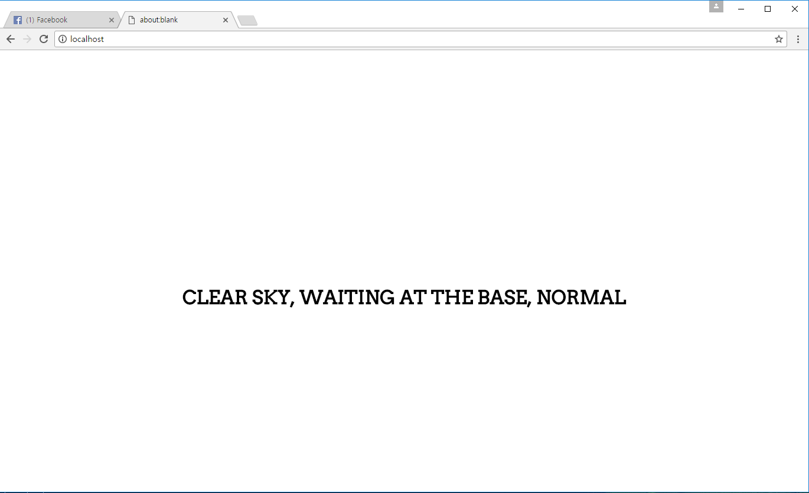

## LocalTum (localhost + momentum clone project)



### 2017년 5월 26일 수정(예정) 사항

- **[수정완료]** 한국어 문구를 적용하기 위하여 앞서 사용하던 구글의 `Arvo` 폰트를 `제주특별자치도청`의 `제주고딕`으로 바꿈.

    - 깨끗해서 선택하게 되었음

    - `Arvo`는 한국어 폰트를 지원하지 않음

- **[작업중]** 앞서 사용하던 `영어` 에서 `한국어`로 작업중

    - 날씨, 미세먼지, 버스 정보 싹 `한국어`로 교체 예정

    - 날씨 코드 받아다가 처리하는 것으로 바꿀 예정

    - 기상청 RSS 쪽에서 날씨 받아다가 처리하는 방안도 생각해보고 있음

### 이건 왜 만들었냐?

- 그냥 심심해서요 ~~코드쓰는 손이 근질근질해서 그렇습니다~~

- 노드도 공부해볼겸

- 모멘텀은 유료지만, 이건 오픈에다가, 심플합니다, 시간도 없고, 날씨, 버스정보, 미세먼지 만 파싱합니다

- 버스는 버스정보시스템의 것을 가져와서 사용할려고 했지만 그냥 15분 정도 노가다를 해서 시간표 알아내서 그거 가지고 평균시간 구해서 사용하고 있습니다.

    - API하나 신청하는데 빠릿빠릿하게 안나오고 한 일주일 정도 있어야 나옵니다 ㅠㅠ 

    - 차라리 headless 브라우저 하나 띄워서 사용하는 방법도 있는데 그걸 사용하는게 훨 좋을껍니다.

    - ~~경남여객의 혼을 담아서 한번 집앞을 지나갈 시간 예측 해보겠습니다~~

### 이거 사용하기 전에 셋팅 어떻게 하는겨?

1. git clone 하시고

2. 7번, 8번 라인 보면 각각 AQICN, OpenWeatherMap API 설정하는 곳이 있음

```javascript
var token = {'aqi':'YOUR_API_KEY', 'weather':'YOUR_API_KEY'};
var location = {'weather':'YOUR_HOME_LOCATION', 'aqi':'YOUR_HOME_LOCATION'};
```

3. API 키 발급은 무료, JSON 형식을 따라서 6번 밑과 같이 설정하면 됨

4. 그리고 weather 의 경우에는 5자리의 OpenWeatherMap 코드가 있음 그거 찾아서 복사해서 붙여넣으시고 (String), aqi는 다음에 따라서 복사해서 붙여넣으시면 됨.

5. 구글에서 적절하게 `aqicn 사는곳` 검색하면 다음과 같은 링크가 보이는데, 이걸 Korea부터 쫙 끝까지 복사+붙여넣기 하면 됨.

    - 경기도 수원시를 예로 들면: http://aqicn.org/map/korea/gyeonggi/suwon-si/

    - 그럼 여기에서 `korea/gyeonggi/suwon-si` 만 복사해서 붙여넣으면 됩니다. 참 쉽죠?

6. 그래서 다음과 같이 설정하면 **설정은 끝남**

```javascript
var token = {'aqi':'abcdedfefegeet12345', 'weather':'assahimeulnayasanda6666666'};
var location = {'weather':'48856', 'aqi':'korea/gyeonggi/suwon-si'};
```

7. 이제 모듈을 설치하는데, `npm install express`, `npm install request`, `npm install pug` 커맨드창에 입력해서 설치하면 되고

8. 지금 이 git 폴더에 왔다고 가정하고 `node start.js`를 입력한 후에 데이터 첫 동기화를 위하여 8초 정도 기다리면 됨

9. 그러면 알아서 날씨는 2시간, 미세먼지는 1시간 반에 한번씩 알아서 동기화 됨

10. 브라우저에서 localhost 입력해보면, **아주 심플하고, 간결하고, 깔끔한 페이지 하나가 뜲**

### LICENSE ~~롸센스?~~ 

```javascript
var license = null;
console.log("우리집은 라이센스 그런거 취급 안한다네, BSD? GPL? 다 가라해~");
```