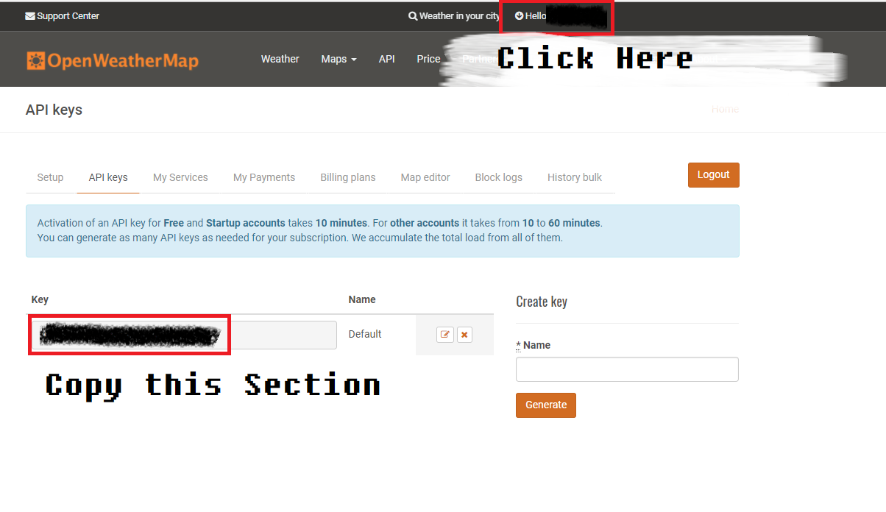
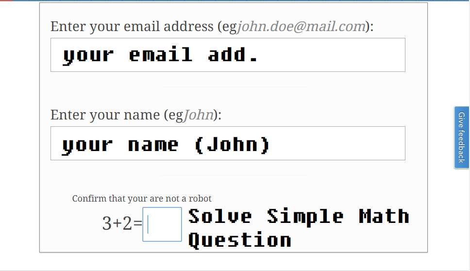

# Welcome to LocalTum

[Brief Video About LocalTum(YouTube @ 720p 48fps)](https://youtu.be/O1tpNngIbfI)

### Support Function

- Weather Celcious

	- Will Be ADD Weather Condition ASAP

- Air Quality Index

	- Will Be ADD AQI Condition ASAP
	
### Future Update

- Transport Information

	- Subway
	
	- Buses

### Browser Side Template

- From W3.CSS Template

	- Modified 
	
	- Image From 
	
		- Midtown Manhattan skyline, night view! New York 1930s - [@cobravictor](https://flic.kr/p/dqci3x)
	
- JQUERY FOR Query JSON Data

### Support Browser

Just Setup as start page to use it, I will making an Chrome Version of Module.

(Unforuneately, Opera Does not Support New Tab Extension (**I TRIED**), FireFox is Support this [Function](https://developer.mozilla.org/en-US/Add-ons/WebExtensions/manifest.json/chrome_url_overrides))

### Support OS

OS|Detail
---|---
Windows|Support - Tested on Windows 10
Linux|Support - Tested on UBUNTU 16.04
Mac|Will Be Run Smoothly

(If you found an error on Mac, Please Report An Error. I don't have an MAC.. Sorry!)

### Install node.js server for serving back-end data

- Install Node.js 

	- **For Windows**: Download File and Install.
	
		- https://nodejs.org/en/download/
		
		- For Stable Version.
	
	- **For Linux**: Follow This Instructions for Specified Linux Distribution.
	
		- https://nodejs.org/en/download/package-manager/
	
	- **For Mac**: Download File and Install 
	
		- https://nodejs.org/en/download/
		
		- For Stable Version
		
- `npm` config and run process 
	
	- Run `npm install` **First!**
	
		- `scanf` module
	
	- Run `npm config` **Second!**
	
		- **FIRST** YOU SHOULD SIGN IN OPENWEATHERMAP
		
			- DONT WARRY! It's FREE
			
			- COPY & PASTE WHEN YOUR CONFIG PROGRAM ASKS YOUR OWM'S API KEY
			
			- Go to your Account Settings -> Click API Keys on Top -> Copy   
			
		- **SECOND** YOU SHOULD SIGN IN AQICN.ORG
		
			- DONT WARRY! IT's FREE
			
			- COPY & PASTE WHEN YOUR CONFIG PROGRAM ASKS YOUR AQICN'S API KEY
			
				- First, Request an [Data Key](http://aqicn.org/data-platform/token/#/)
				
				- 
				
				- Second, When youre click url On Response Email, It'll appear Token page, copy it and paste to console
	
	- Run `npm start` **Third**
	
	- **IT MUST BE RUN THIS STEP, IT WILL MAKE AN ERROR**

### Donate!

- Please Donate Me!

	- Cause I don't have a Mac :cry: :cry: :cry:   

	- Bitcoin ADDRESS: 18xJLKffgahZCychCNyrMPfUGqb7UTaCLS
	
	- Bitcoin QR CODE:   
	
	- Donaitor List
	
		- `No one :cry:`
	
- Contact Me if you want to Donate Directly :) 

	- Email Address: jaeseung172.crb@gmail.com
	
## LICENSE 

- [I Dont Care EEEEEEE](https://www.youtube.com/watch?v=4MgAxMO1KD0)

	- Just clone and make your version!
	
	- And Please Don't forget to Donate!